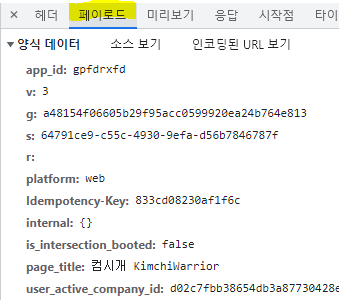

## 1. 메세지의 흐름

HTTP메세지는 HTTP 애플리케이션 간에 주고 받은 데이터의 블록들.

메세지는 클라이언트,서버,프락시 사이를 흐름

메세지의 방향을 의미하는 용어: 인바운드,아웃바운드,업스트림,다운스트림

### 인바운드,아웃바운드?

- 트랜잭션 방향 표현하기 위해 사용
- 메세지가 원 서버로 향하는 것이 인바운드로 이동
- 모든 처리가 끝난 뒤에 메세지가 사용자 에이전트로 돌아오는 것이 아웃바운드로 이동

### 다운스트림

- 모든 메세지는 다운스트림으로 흐란다!

## 2. 메세지의 각 부분

- 메세지는 시작줄,헤더블록,본문으로 이루어짐.
- 시작줄: 이것이 어떤 메세지인지 서술
- 헤더블록: 속성
- 본문: 데이터를 담고 있음 (아예 없을 수도 있음)

### 요청 메세지 형식

```java
[시작줄] <메서드> <요청 URL> <버전>
[헤더] <헤더>

[본문] <엔터티 본문>
```

- 메서드: 서버가 리소스에 대해 수행해주길 바라는 동작
- 요청 url: 요청 대상이 되는 리소스 지칭하는 완전한 URL 혹은 URL의 구성경로
- 엔터티 본문: 임임의 데이터 블록 포함. 모든 메세지가 본문을 갖는게 아니므로 그냥 CRLF로 끝날 때도 있다.

### 응답 메세지 형식

```java
[시작줄] <버전> <상태코드> <사유구절>
[헤더] <헤더>

[본문] <엔터티 본문>
```

- 상태코드: 요청 중에 무슨 일이 일어났는지 설명하는 세자리 숫자
- 사유구절: 숫자로 된 상태코드의 의미를 사람이 이해할 수 있게 설명해주는 짧은 문구

### 시작줄

- 요청메세지는 무엇을 해야하는지 말해주고, 응답메세지는 무슨 일이 일어났는지 말해준다.


- 상태코드를 보면 200~299는 성공, 300~399 리소스가 옮겨짐, 400~499는 클라이언트가 잘못된 요청을 했음, 500~599는 서버에서 뭔가 실패했음을 의미한다.
- 버전번호: 자신이 따르는 프로토콜의 버전을 상대방에게 말해주는 수단

### 헤더

- HTTP헤더는 요청과 응답메세지에 추가 정보를 더한다.  이름/값 쌍의 목록이다.
- 헤더는 일반 헤더,요청 헤더,응답 헤더,Entity 헤더, 확장 헤더로 분류할 수 있다.

## 메서드

### 안전한 메서드

- GET,HEAD메서드
- 서버에 어떤 작용도 없기 때문 (== 서버에서 일어나는 일은 아무것도 없다)
- 안전한 메서드의 목적은 서버에 영향을 줄 수 있는 안전하지 않은 메서드가 사용될 때 사용자들에게 그 사실을 알려주는 HTTP 애플리케이션을 만들 수 있도록 하는 것에 있음.

### ⭐ 멱등성이란?

[https://velog.io/@gidskql6671/HTTP-Method의-멱등성](https://velog.io/@gidskql6671/HTTP-Method%EC%9D%98-%EB%A9%B1%EB%93%B1%EC%84%B1)

- 연산을 여러번 적용하더라도 **결과가 달라지지 않는 성질**을 의미한다.
- 동일한 요청을 **한번** 보내는 것과 **여러번 연속**으로 보내는 것이 **같은** 효과를 가지고, **서버의 상태도 동일**하게 나을 때 해당 HTTP메서드가 멱등성을 가진다고 한다.
- **결과**가 의미하는 것이 응답 상태코드가 아닌 **서버의 상태** 라는 중요하다. 예를 들어, 똑같은 요청을 했을 때 응답하는 상태코드가 바뀌더라도 **서버의 상태가 항상 같은 상태라면 멱등성이 있다**고 판단한다.

| 메서드 이름 | 멱등성 여부 | 추가사항 |
| --- | --- | --- |
| GET | O | 서버 상태변경 X |
| POST | X | 새로운 자원이 생기는 것은 서버 상태가 변경된다는 것 |
| PUT | O | POST는 새로운 자원을 매번 만드는 반면 PUT은 해당 자원이 있으면 데이터를 덮어쓰기만 함. 요청을 한번 하던 여러번 하던 서버의 상태는 결국 같음! |
| PATCH | 기본은 X 예외는 O  | 기본적으로 멱등성 가지지 않는데 구현을 PUT과 같이 하면 멱등성 가짐. 만약 데이터를 덮어쓰는 것이 아닌 동작을 지정해준다면 멱등성을 가지지 않음  |
| DELETE | O | 여러번 요청하더라도 해당 리소스는 삭제된 상태 그대로. 서버의 상태 변하지 않음.  |

### GET

- 서버에게 리소스 달라고 요청할 때 쓰임


### HEAD

- GET처럼 행동, 서버는 응답으로 헤더만 돌려주고, 엔터티 본문은 반환되지 않음


### PUT

- 요청 URL 이름대로 새 문서를 만들거나, 이미 URL이 존재한다면 본문을 교체해서 사용

### POST

- 서버에 입력데이터 전송하기 위해 설계

### TRACE

- 클라이언트가 요청을 할 때, 그 요청은 방화벽,게이트웨이,프락시등의 애플리케이션 통과할 수 있는데 이 때 조금씩 달라질 수 있음
- TRACE는 자신의 요청이 서버에 도달했을 때 어떻게 보이는지 알려줌.
- 클라이언트는 자신과 목적지 서버 사이에 있는 모든 HTTP 애플리케이션의 요청/응답 연쇄를 따라가면서 자신이 보낸 메세지가 망가졌거나 수정되었는지, 어떻게 변경되었는지 확인 가능
- 어떠한 엔터티 본문도 보낼 수 없다!

### OPTIONS

- 웹 서버에 여러가지 종류의 지원범위에 대해 물어봄
- 특정 리소스에 대해 어떤 메서드가 지원되는지 물어볼 수 있음

### DELETE

- 클라이언트는 삭제가 수정되는 것을 보장하지 못함
- WHY? HTTP명세는 서버가 클라이언트에게 알리지 않고 요청을 무시하는 것을 허용하기 때문

### PATCH

- 부분수정을 할 때 사용
- 기본적으로 멱등성을 가지지 않지만 구현을 PUT과 동일하게 할 경우 멱등성 가짐.
- PUT은 요청 Body로 덮어쓸 데이터가 위치해야하며 기존의 리소스가 해당 데이터로 완전히 덮어씌워짐. PATCH는 요청 body에 꼭 덮어쓸 데이터가 있을 필요가 없다(HTTP 스펙상 구현 방법에 제한이 없기 때문)
- 동일한 요청을 여러번 보내고, 매 요청마다 age가 1씩 증가 한다면 멱등성 가지지 않음

### 확장 메서드

- HTTP/1.1명세에 정의되지 않은 메서드
- 개발자들에게 그들의 서버가 구현한 HTTP 서비스의 서버가 관리하는 리소스에 대한 능력을 확장하는 수단을 제공

## 상태코드

- 클라이언트에게 트랜잭션을 이해하는 쉬운 방법 제공

### 100~199: 정보성 상태코드

- 100 Continue는 HTTP 클라이언트가 서버에 엔터티 본문 전송하기 전에 그 엔터티 본문을 서버가 받아들일 것인지 확인하려고 할 때 확인 작업 최소화 하기 위해 도입.
- 만약 클라이언트가 엔터티를 서버에 보내려 하는데 그 전에 100 Continue 응답을 기다리면 값을 **100-Continue로 하는 Expect 요청헤더를 보내야함**
    - 만약 서버가 100 Continue 응답을 받을 것을 의도한 요청을 받고 나서 엔터티 본문을 읽기전에 요청을 끝내려 한다면 서버는 그냥 응답을 보내고 연결을 닫아서는 안됨 → 클라이언트가 응답을 받을 수 없게되기 때문!
- 엔터티 보내지 않으면 **100-Continue Expect 헤더 보내지 않아야함.**
- 100-Continue는 서버가 다루거나 사용할 수 없는 큰 엔터티를 서버에 보내지 않으려는 목적으로만 사용하는 것 추천.

++) 홉서버: 요청이 오는 서버 같은 느낌

### 200~299: 성공 상태 코드

### 300~399: 리다이렉션 상태 코드

- 클라이언트가 관심있어 하는 리소스에 대해 다른 위치를 사용하라고 말해주거나 그 리소스의 내용 대신 다른 대안 응답을 제공한다.
- 만약 리소스가 옮겨졌다면 클라이언트에게 리소스가 옮겨졌으며 어디서 찾을 수 있는지 알려주기 위해 리다이렉션 상태코드와 Location 헤더를 보낼 수 있다.

**📐 Q1. 300번대는 다 비슷해보이는데 왜 302,303,307간에 중복되는 상태코드를 넣었을꺼?**

→ 시맨틱 태그 처럼  그 안에 세부적인 의미가 있어서 그런거 아닐까?

→ 실제로 책에서도 중복되는 부분이 있지만 미묘한 차이가 있다고 한다. (혼란을 막기 위함)

**📐 Q2. 301을 언제써야 할까요?**

→ 보통 301은 요청한 URL이 옮겨졌을 때 사용한다. 

예를들어 웹사이트의 도메인을 변경했거나 새로운 URL 구조로 개편했을 때 사용할 수 있다. 검색엔진은 301 요청을 만나면 컨텐트가 **새로운 URL로 영원히 이동했다고 판단한다**. 따라서 검색엔진은 과거 URL의 페이지랭킹과 평가점수를 새로운 URL로 이동시킨다.

📐 Q3. **302 리다이렉트는 무엇인가요?**

302 리다이렉트의 의미는 요청한 리소스가 **임시적으로 새로운 URL로 이동했음(Temporarily Moved)**을 나타낸다. 따라서 검색엔진은 페이지랭킹이나 링크에 대한 점수를 새로운 URL로 옮기지 않으며 **기존 URL을 그대로 유지한다**. 즉 검색엔진이 기존 URL이 보유한 페이지랭킹 점수는 그대로 유지하도록 하면서 컨텐트만 새로운 URL에서 조회하도록 해야할 때 유용하다.

[https://nsinc.tistory.com/168](https://nsinc.tistory.com/168)

### 400~499 : 클라이언트 에러 상태 코드

- 클라이언트가 서버한테 다룰 수 없는 무언가를 보낼 때 띄우는 코드

### 500~599: 서버 에러 상태 코드

- 클라이언트가 올바른 요청을 보냈음에도 서버 자체에서 에러 발생
    - 서버 제한
    - 서버의 보조 구성요소에서 발생한 에러
    - 프락시는 클라이언트 입장에서 서버와 대화할 때 에러를 자주 만나는데 프락시가 문제를 설명하기 위해 5XX 서버 에러 상태코드 생성

## 헤더

### 일반헤더

- 클라이언트와 서버 양쪽 모두가 사용
- 메세지에 대한 아주 기본적인 정보 제공

| Connection | 연결에 대한 옵션 설정 |
| --- | --- |
| Date | 메세지가 만들어진 날짜  |
|  MIME-Version | 발송자가 사용한 MIME의 버전 알려줌  |

++) MIME: ASCII가 아닌 문자 인코딩을 이용해 영어가 아닌 다른 언어로 된 전자 우편을 보낼 수 있는 방식을 정의한다.

- 일반 헤더 예시


### 요청헤더

- 요청메세지를 위한 헤더
- 요청 메세지에서만 의미를 가진다.
- 누가 혹은 무엇이 그 요청을 보냈는지에 대한 정보나 클라이언트의 선호나 능력에 대한 정보를 준다.
- 요청 헤더 예시


**Accept 관련헤더**

- 서버에게 자신의 선호와 능력을 알려줌
- 클라이언트는 자신이 원하는 것을 얻을 수 있으며 서버는 클라이언트가 사용할 수 없는 것을 전송하는데 시간과 대역폭 낭비하지 않을 수 있다.

**조건부 요청 헤더**

- 클라이언트는 서버에게 요청에 응답하기 전에 먼저 조건이 참인지 확인하게 하는 제약 포함시키기 가능

**요청 보안 헤더**

- 보통 Authorization이나 cookie 헤더를 담고 있다.
- 요청 보안 헤더 예시


**프락시 요청 헤더**

- Max-Forwards, Proxy-Authorization, Proxy-Connection이 있다.
- Max-Forwards의 경우 요청이 원서버로 향하는 과정에서 다른 프락시나 게이트 웨이로 전달될 수 있는 최대 횟수로 TRACE메서드와 함께 사용된다.

### 응답헤더

- 응답메세지는 클라이언트에게 정보를 제공하기 위한 자신만의 헤더를 가진다.
- 응답헤더 예시
    
    
    

**협상헤더**

- 서버가 보내는 형태와 클라이언트가 받는 형태가 다양할 수 있다.(이미지 파일 등등)
- 이걸 어떤 형식으로 전달할지 협상헤더를 통해 결정한다.
- 특히 **인코딩방식**을 협상헤더를 통해 결정하고 가중치도 준다!

**응답보안 헤더**

- 기본적인 인증요구 헤더들을 포함한다.
- Proxy-Authenticate, Set-Cookie,Set-Cookie2 등이 있다.

### 엔터티헤더

- 엔터티 본문에 들어있는 데이터 타입등을 말해준다. (예를 들면 Content-Type)
- 엔터티 헤더는 메세지의 수신자에게 자신이 다루고 있는것이 무엇인지 말해준다.
- 엔터티 헤더 예시


**콘텐츠 헤더**

- 엔터티 콘텐츠에 대한 구체적인 정보를 제공한다.
- 대표적으로 Content-Type,Content-Length 등이 있다.

엔터티 캐싱 헤더

- 일반 캐싱 헤더는 언제 어떻게 캐시가 되어야 하는지 지시자를 제공한다.
- 엔터티 캐싱 헤더는 엔터티 캐싱에 대한 정보를 제공한다.
- Etag가 많이 보이는데 이는 엔터티에 대한 엔터티 태그라 한다.


### 확장헤더

- 애플리케이션 개발자들에 의해 만들어졌지만 아직 승인되지 않은 HTTP명세에는 추가 되지 않은 비표준 헤더
- 사용자가 임의로 헤더를 정의할 때, 사용자가 정의한 헤더라는 것을 알려주기 위해 앞에 X-를 붙이곤 했다고 한다.
- 나같은 경우는 jwt 전달할 때 Authorization이 아닌 X-ACCESS-TOKEN에 실어보낸다

[https://www.zerocho.com/category/HTTP/post/5b611b9e33b4636aa8bb1fc4](https://www.zerocho.com/category/HTTP/post/5b611b9e33b4636aa8bb1fc4)

## 몰랐던 단어 정리

### CRLF

- CR은 Carriage Return의 약자로 현재 라인에서 커서의 위치를 가**장 앞으로 옮기는 동작**
- LF는 Line Feed의 약자로 커서의 위치는 그대로 두고 종이를 **한 라인 위로 올리는 동작**
- 간단히 말해 줄바꿈 입력하는 문자를 지칭하는 표현

### Payload




payload 는 body 에 담기는 data, 보내고자 하는 데이터 자체를 의미한다.

POST메서드에서만 확인 가능 

### ping

ping (Packet INternet Groper)는 대상 컴퓨터를 향해 일정 크기의 패킷을 보낸 후, 대상 컴퓨터가 이에 대한 응답 메세지를 보내면 이를 수신하여 대상 컴퓨터 **동작 여부 혹은 네트워크 상태를 파악**할 수 있다.