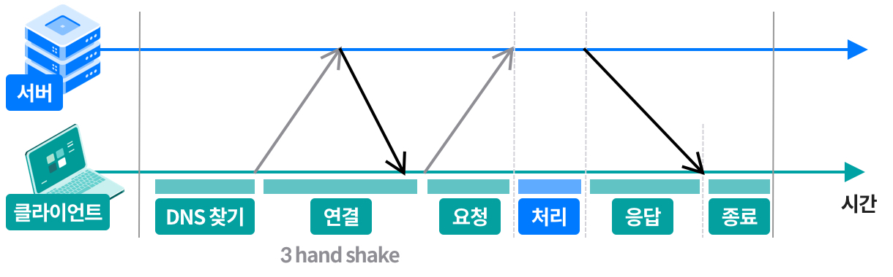
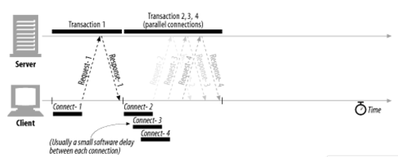
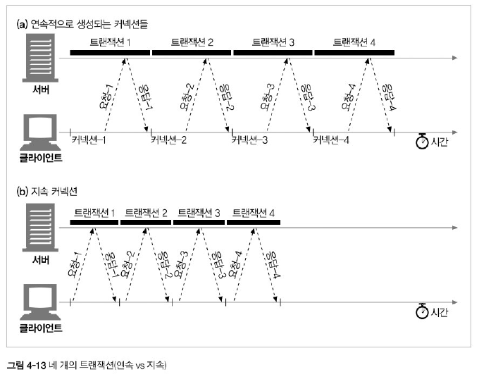
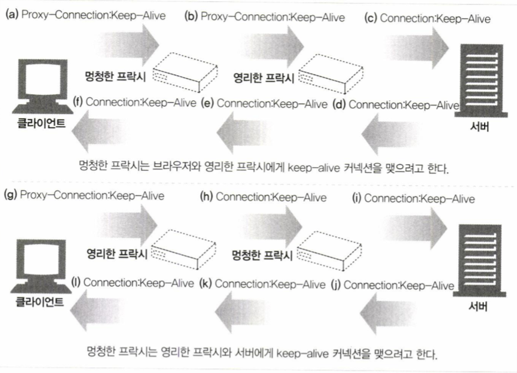
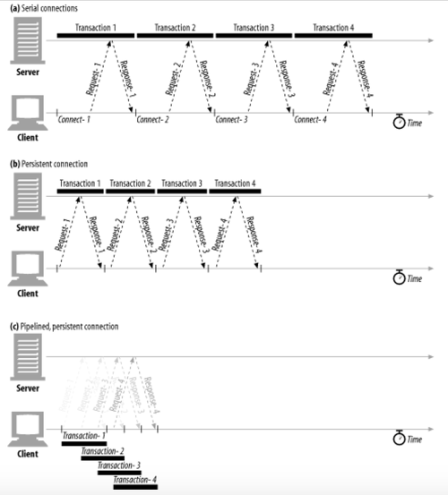

# 📐 학습 목표

- TCP 커넥션
- TCP 커넥션의 지연,병목,막힘
- 병렬 커넥션, keep-alive, 커넥션 파이프라인을 활용한 HTTP최적화
- 커넥션 관리 규칙 (우아한 커넥션)

## TCP 커넥션

- **TCP는 Reliable한 data transfer다**
    - 메세지들이 손실혹은 손상되거나 순서가 바뀌지 않고 안전하게 전달된다.
    - 바이트들의 순서 정렬 보장
- **HTTP데이터 스트림 → tcp세그먼트 분할 → IP패킷으로 캡슐화**
    - HTTP가 메세지를 전달하고자 할 때 TCP 커넥션을 통해 세그먼트 단위로 데이터 스트림을 잘게 나누고
    - 세그먼트를 IP패킷이라 불리는 봉투에 담앗거 인터넷을 통해 데이터 전달
- **TCP의 커넥션 유지는 포트번호로!**
    - <발신지 ip주소, 발신지 포트, 수신지 ip주소, 수신지 포트>
    - 네가지 값으로 유일한 커넥션 생성
- **TCP 소켓 인터페이스 → 소켓 API**
    - 초기 유닉스용으로 먼저 개발
    - 지금은 소켓 API의 다양한 구현체들 덕분에 대부분의 운영체제와 프로그램 언어에서 이를 사용
    - 서버에서 소켓열고 bind하고 클라이언트에서 listen하면 accept

### 소켓이 뭐지?

- 소켓은 **네트워크 상에서 돌아가는 두 개의 프로그램 간 양방향 통신의 하나의 엔트 포인트**
- 소켓은 포트 번호에 바인딩되어 TCP 레이어에서 데이터가 전달되야하는 어플리케이션을 식별할 수 있게 함.
- 두 소켓이 연결되면 서로 다른 프로세스끼리 데이터 전달
- 통신을 위한 일종의 통로라고 생각할 것 !

## TCP 성능에 대한 고려

### HTTP 트랜잭션 지연

- 대부분의 HTTP 지연은 TCP 네트워크 지연 때문에 발생
- HTTP트랜잭션을 지연시키는 원인
    - URI→서버 ip주소, 포트번호 알아내기 할 때 지연
    - 3 HandShake할 때 지연
    - 웹서버가 요청 메세지 읽고 처리하는데 지연
    - 웹서버가 HTTP 응답을 보낼 때 지연

### TCP 관련 지연

- **TCP 커넥션의 핸드셰이크**
    - 작은 크기의 데이터 전송에 커넥션이 사용된다면 이런 패킷교환은 HTTP의 성능을 크게 저하시킴
    
    → TCP 세그먼트는 40바이트 상당의 플래그와 헤더를 포함하여 전송하기 때문에 TCP가 작은 크기의 데이터를 포함한 많은 수의 패킷을 전송한다면 네트워크 성능은 크게 떨어짐
    
    - SYN을 통해 커넥션 생성 요청 → SYN+ACK를 통해 서버가 커넥션 요청 받아들임 →  ACK를 통해 클라이언트가 커넥션이 잘 맺어졌음을 알리기 위해 서버에 확인 응답신호 보냄
    - SYN/SYN+ACK가 눈에 띄는 지연 발생시킴
    - ACK의 경우 HTTP요청 전체를 전달할 수 있을만큼 큰 패킷
    - 작은 HTTP 트랜잭션은 50%이상의 시간을 TCP 구성하는데 씀.

- **TCP의 느린시작**
    - TCP 커넥션은 시간이 지나면서 자체적으로 튜닝된다. 처음에는 최대 속도 제한하고 성공적으로 전송됨에 따라서 속도 제한을 높여 나간다.
    - 느린시작은 급작스러운 부하와 혼잡을 방지하는 데 쓰인다.
    - TCP가 한번에 전송할 수 있는 패킷의 수를 제한, 성공하면 패킷의 수를 늘린다 → 혼잡 윈도우를 연다

- **네이글 알고리즘**
    - 패킷을 전송하기 전에 많은 양의 TCP 데이터를 한 개의 덩어리로 합친다.
    - 세그먼트가 최대 크기가 되지 않으면 전송하지 않는다
    - 모든 패킷이 확인 응답을 받으면 최대 크기가 되지 않더라도 전송을 허락한다.
    - 단점
        - 크기가 작은 HTTP 메세지는 패킷을 채우지 못하기 때문에 추가적인 데이터 기다리며 지연
        - 확인응답지연과 함께 쓰이면 형편없이 동작 (네이글은 확인응답이 도착할 때까지 데이터 전송 멈춤 + 확인응답은 확인응답을 100~200 밀리초 지연)

- **TCP 편승 확인응답을 위한 확인 응답 지연 알고리즘**
    - TCP 세그먼트는 순번과 데이터 무결성 체크섬 가짐
    - 확인응답은 크기가 작기에 TCP는 같은 방향으로 송출되는 데이터 패킷에 확인응답을 편승시킴
    - 송출 데이터 패킷과 확인응답을 하나로 묶음으로써 네트워크를 효율적 사용
    - 확인응답 지연은 송출할 확인응답을 특정시간동안 (0.1~0.2초) 버퍼에 저장해두고 확인응답을 편승시키기 위한 송출데이터 패킷을 찾는다.

- **TIME_WAIT 지연과 포트고갈**
    - TIME_WAIT이란 연결 종료 시 마지막 패킷 전송 실패를 대비하기 위한 상태
    - TCP 커넥션을 끊으면 커넥션의 ip주소와 포트번호를 메모리의 작은 제어영역에 기록함
    - 이는 이전 커넥션과 관련된 패킷이 이전 커넥션과 같은 주소와 포트번호를 가지는 새로운 커넥션에 삽입되는 문제 막기 위함
    - 만약 이전 커넥션의 패킷이 같은 연결값으로 생성된 새로운 커넥션에 삽입되면 패킷은 중복되고 TCP데이터는 충돌날 것임.
    - [https://m.blog.naver.com/PostView.naver?isHttpsRedirect=true&blogId=cache798&logNo=130039539454](https://m.blog.naver.com/PostView.naver?isHttpsRedirect=true&blogId=cache798&logNo=130039539454)

++)커넥션을 계속 여는 것은 성능 저하에 큰 영향을 줌

## Connection관리

- **Connection 헤더**
    - http는 클라이언트와 서버 사이 중개 서버가 놓이는 것을 허용
    - 두 개의 인접한 HTTP 애플리케이션이 현재 맺고 있는 커넥션에만 적용될 옵션을 지정해야할 때가 있음.
    - 예를 들어 Connection:close 이면 메세지를 보낸 다음 끊어져야 할 커넥션이라는 의미.
    - Connection에 있는 모든 헤더필드는 메세지를 다른 곳으로 전달하는 시점에 삭제되어야 함.
    - hope-by-hop 헤더 → 헤더 보호하기
    - Connection 헤더의 작동방식
        - Connection헤더와 함께 메세지 전달받으면 수신자는 송신자에게서 온 요청에 해당하는 모든 옵션 적용
        - 홉(hop)에 메세지 전달하기 전에 Connection헤더와 Connection헤더에 기술되어 있는 모든 헤더 삭제

- **순차적인 트랜잭션에 의한 지연**
    - 순차적으로 로드하게 된다면 특정 브라우저의 경우 객체를 화면에 배치할때 객체의 크기를 알아야 하기 때문에 모든 객체를 내려받기 전까진 텅빈화면을 보여줌
    - 순차적 트랜잭션의 해결책은 병렬 커넥션, 지속 커넥션, 파이프라인 커넥션, 다중 커넥션

- **병렬 커넥션**

- 여러개의 커넥션을 만들어서 받아오면 빠르겠다!
- 커넥션의 지연시간을 겹치게 하면 총 지연시간 줄일 수 있고 클라이언트의 인터넷 대역폭을 한 개의 커넥션이 다 써버리는 것이 아닌 나머지 객체를 내려받는 데 남은 대역폭 사용 가능
- 단점
    - 대역폭이 좁으면 → 데이터를 보낼 수 있는게 적기떄문에 차라리 순차적으로 주는게 나을 수도
    - slow start때문에 느려질 수 있음(처음에 적게 보내니까)
    - 실제로 연결할 수 있는 병렬 커넥션 수는 제한됨

- **지속커넥션**
    - 지역성: 서버에 HTTP 요청을 하기 시작한 애플리케이션은 웹페이지 내의 이미지등을 가져오기 위해 그 서버에 또 요청을 할 것이라는 속성
    - 처리가 완료된 후에도 계속 연결된 상태로 있는 TCP 커넥션을 지속 커넥션이라 함.
    - 장점
        - 커넥션을 맺기 위한 사전 작업과 지연을 줄여줌
        - 튜닝된 커넥션 유지
        - 커넥션 수 줄여줌
    - 단점
        - 잘못 관리할 경우 수 많은 커넥션이 쌓임
    - 지속커넥션은 병렬커넥션과 함께 쓰일 때 가장 효율적
    - 지속 커넥션 타입에는 HTTP/1.0+에는  keep-alive와 HTTP/1.1에는 지속커넥션이 있다.

- **Keep-alive**
    - 연속적으로 생성되는 커넥션들에 비해 맺고 끊는데 필요한 작업이 없어서 시간이 단축.
    - 클라이언트는 커넥션을 유지하기 위해 Connection:Keep-Alive 헤더를 포함시킴
    - 헤더가 없으면 클라이언트는 서버가 keep-alive 지원하지 않으며 서버 커넥션을 끊을 것이라 추정
    - 언제든지 keep-alive 를 끊을 수 있으며 처리되는 트랜잭션 수 제한 가능
    - **멍청한 프락시**
        
        <클라이언트- 프락시>
        
        - 클라이언트는 프락시에 Connection:Keep-Alive 헤더와 함께 메세지 전송
        - 프락시는 Connection헤더를 이해하지 못함 → 해당 헤더들을 삭제하지 않고 요청 그대로 다음 프락시에 전달 (원래 Connection에 담긴 헤더들은 다음 커넥션에 영향을 주면 안되기 때문에 헤더 값들을 모두 삭제해야함)
        - 프락시는 keep-alive를 단순히 확장헤더로 이해해버린다. 그리고 이걸 서버에 전달
        
        <서버-프락시>
        
        - 웹서버는 커넥션을 유지하자고 요청하는 것으로 잘못 판단, 프록시와 커넥션을 유지하자는 것에 동의하고 Connection:keep-alive 헤더 포함시킴
            
            ⭐ 원래는 프록시가 keep-alive를 이해하고 커넥션에 대한 응답을 진행해야함.
            
            ⭐ 요청에 대한 것을 중개하는게 아니라 요청이 끊길때까지 기다리면서 지연의 문제가 생김.
            
        - 멍청한 프락시는 서버로 부터 받은 keep-alive를 또 이해하지 못하고 그대로 클라이언트에 전달.
        
        <클라이언트-프락시>
        
        - Connection : Keep-Alive 헤더 응답 메시지를 받았기 때문에 클라이언트는 프락시가 커넥션을 유지하고 있다고 생각
        - 다음 요청을 커넥션이 유지되고 있는 프락시에 보냄
        
        <프락시-서버>
        
        - 프락시는 keep-alive 여전히 이해를 못하고, 서버가 커넥션 끊기를 기다림, 그러나 서버는 커넥션을 유지하는 것으로 이해했기에 커넥션 끊기지 않음
        
        <클라이언트-프락시>
        
        - 그러던 도중 클라이언트에 다른 요청이 옴 → 같은 커넥션 상에 다른 요청이 오는 것을 프락시는 예측하지 못하기에 요청이 프락시로부터 무시되고, 브라우저는 아무 응답없이 종료
        - 결국 브라우저는 자신이나 서버가 타임아웃이 돼서 끊길때까지 기다림.
    
    - **영리한 프락시**
        - 한줄 정리: keep-alive의 의미를 알기 때문에 서버에 요청하고 이를 수락하면 서버와의 연결을 유지한채 클라이언트에 응답.
    - Proxy-Connection
        - 헤더를 무조건 전달하는 문제의 차선책
        - Connection헤더 대신 Proxy-Connection이라는 확장헤더를 프락시에 전달
        - 프락시가 Proxy-Connection을 무조건 전달하더라도 웹서버는 무시하기에 문제가 되지 않음
        - 단점
            - 클라이언트와 서버 사이에 한개의 프락시만 있는 경우에 동작

- **지속 커넥션**
    - HTTP/1.1에서는 별다른 설정 하지 않는 이상 모든 커넥션을 지속커넥션으로 취급
    - 커넥션 끊으려면 Connection:close 명시해야함.
    - 커넥션에 있는 모든 메세지가 자신의 길이 정보 정확히 가지고 있을 때만 커넥션 지속 가능 (Content-Length값 같은거 가지고 있어야)
    - Connection 헤더 값과 상관없이 언제든 커넥션 끊기 가능
    - 중간에 끊어지는 커넥션은 복구해야만 한다.

- **파이프라인 커넥션**
    - 지속커넥션보다 더 빠른게 필요해!
    - 커넥션이 지속커넥션인지 확인하기 전까지는 파이프라인을 이어서는 안된다.
        - 파이프라인: 하나의 동작이 끝나기 전에 다른 동작을 하게 해줘서 병렬처리
    - HTTP응답은 요청 순서와 같게 와야한다.
        - HTTP는 사실상 TCP를 한단계 벗긴것이기에 섞일 시 순서를 모른다
    - 커넥션이 언제 끊어지더라도 완료되지 않은 요청이 파이프 라인에 있으면 언제든 다시 요청을 보낼 준비가 되어있어야한다.
    - POST 요청 같이 반복해서 보낼 경우 문제가 생기는 요청은 파이프라인을 통해 보내면 안된다.
        - 에러가 발생하면 파이프라인을 통한 요청 중에 어떤 것들이 서버에서 처리되었는지 클라이언트가 알 방법이 없음.

## 커넥션 종료

- 커넥션은 트랜잭션이기에 예기치 않게 종료되면 요청을 재시도 해야함!
- **우아한 커넥션**
    - http 명세서는 우아한 커넥션을 해야한다 정도로만 나와있다고 함
    - **전체 끊기**
        - close()
        - 입력채널과 출력채널의 커넥션을 모두 끊는다
    - **절반 끊기**
        - shutdown()
        - 각기다른 클라이언트,서버,프락시가 파이프라인 지속커넥션을 할 때는 절반끊기를 사용해야함
    - 커넥션의 출력채널을 끊는 것이 안전
        - 클라이언트에서 더는 데이터를 보내지 않을 것임을 확신하지 않는 이상 커넥션의 입력 채널을 끊는 것은 위험
        - 이미 끊긴 입력채널에 connection reset by peer를 메세지를 보내면 운영체제는 심각한 에러로 취급하여 버퍼에 저장된 읽히지 않은 데이터를 모두 삭제함
    - **우아하게 커넥션 끊기**
        - 자신의 출력채널을 먼저 끊고 다른 쪽에 있는 기기의 출력 채널이 끊기는 것을 기다림.
        - 상대방이 절반끊기를 구현했다는 보장도 없고 검사해준다는 보장도 없기에 출력채널에 절반 끊기를 하고 난 후에도 데이터나 스트림 끝을 식별하기 위해 입력 채널에 대해 상태검사 주기적으로 해야