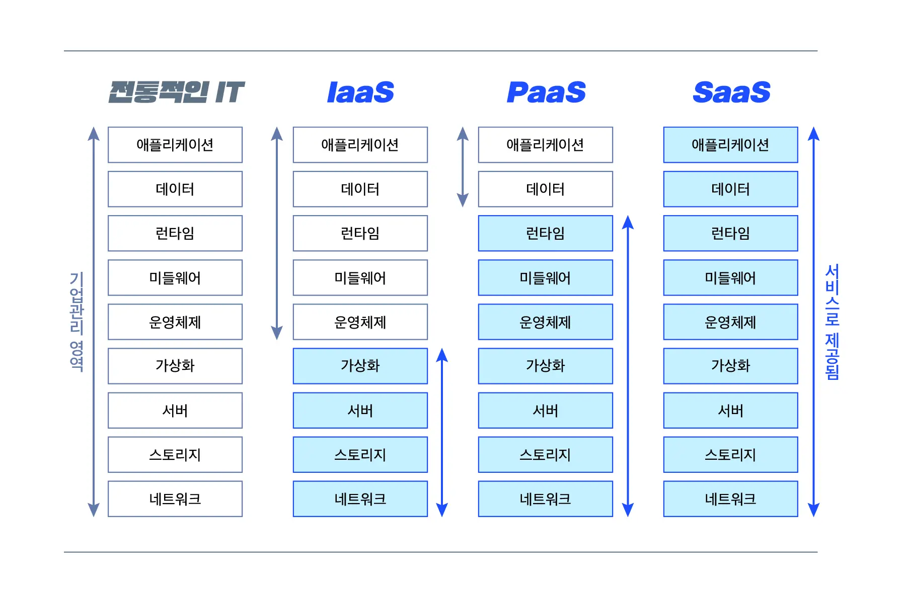

## DX

비즈니스의 근본적 혁신,  비즈니스 주체를 IT에게 주는 것 

이전까지는 비즈니스 주체가 사업부서 인력, IT는 비즈니스 지원도구였음

## DX 실현위한 해결방침

1. **인프라 표준화**
컨테이너에 의한 가상화
컨테이너와 쿠버네티스 등의 컨테이너 오케스트레이션 인프라 구축,운영 : 특정 클라우드 서비스에 종속x
2. **마이크로서비스로 애플리케이션 현대화**
데브옵스 실현
개발,변경 신속하게 뿐만 아니라 자동화 통해 오류 줄임
3. **시스템 도입방법 개선**
SI에서 벗어나 사내 개발자 양성

마이크로서비스란 데브옵스 및 컨테이너와 함께 DX추진하는 주요기술

## 클라우드 네트워크 컴퓨팅이란?

### 목적

확장가능한 애플리케이션 구축 운영하는 것과 IT시스템에 최소한의 인력으로 자주 그리고 계획한만큼 임팩트가 있는 변경 추가하는 것

### 목표

DX가 요구하는 속도와 유연성 실현하는 것

### 중요한거

컨테이너화,오케스트레이션과 어플리케이션 정의, 마이크로서비스,데브옵스

### Recap

컨테이너와 오케스트레이션 : 인프라혁신의 중심
마이크로서비스: 애플리케이션 혁신의 중심

🚀 **데브옵스를 중요하게 생각하는 이유**

1. 애플리케이션 개발 운영을 신속하게 -> 개발 운영기법의 개선
2. 클라우드 네이티브 컴퓨팅 뿐만 아니라 기존 시스템이나 애플리케이션 개발에도 유용

## 컨테이너

- 서버 가상화
- 리눅스 커널 기술을 이용해서 os수준의 가상환경 실현
- 컨테이너형 가상화: **하나의 리눅스 os**상에 여러 개의 가상환경이 호스팅되는 것
컨테이너형에서는 가상환경이 각각 os이미지 사용하는게 아닌 **하나의 os공유**

## 컨테이너 오케스트레이션

- 여러개의 애플이케이션 서버로 구성된 클러스터 구축 -> why?: 가용성과 확장성 담보하기 위함
- 컨테이너는 마이크로서비스의 각 실행환경으로 이용
- 하나의 어플리케이션이 여러개의 서비스 구성 → 하나의 어플이케이션을 여러개 컨테이너 사용해 구성
- 이런 클러스터 멤버들(컨테이너) 관리하려면? ⇒ 컨테이너 오케스트레이션 필요!
- OS처럼 **인프라 운영기능**을 제공하고 컨테이너 애플리케이션의 **생명주기 관리**하는 것이 컨테이너 오케스트레이션의 역할
- 컨테이너 오케스트레이션 솔루션으로 유명한게 쿠버네티스

## 데브옵스

- 신속/빈번/확실하게 개발및 테스트와 릴리스 목표
- 에자일 개발 프로세스: 신속하고 유연하게 소프트웨어 개발 진행하게 해줌
데브옵스에 적용해야할 기법 부분을 구현한게 에자일개발 프로세스
- CD: 짧은주기로 릴리스하기 위한 소프트웨어 엔지니어링 기법
실현해주는게 배포 파이프라인 (빌드,테스트,배포 자동화 툴)
++) CI는 지속적 통합,CD가 지속적 제공

💚 Recap : 에자일 개발 프로세스아 CD등 기존 기법,기술과 연계해 개발/릴리스 속도 향상과 유연한 변경을 애플리케이션 개발/운영의 효율화하라는 관점에서 실현하게 해줌

## 왜 클라우드 네트워크 컴퓨팅해?

- IT시스템 개발 운영속도 향상 및 품질 향상
:컨테이너 오케스트레이션 통한 빠른 기반구축
- 확장성과 고가용성
: 오케스트레이션 프레임워크를 (쿠버네티스)통해 클러스터 손쉽게 작성및 관리가능
    
    오케스트레이션이 제공하는 부하분산, 확장, 자기복구 등 기능을 사용해서 프로덕션 운영에 필요한 확장성과 고가용성 실현
    
- 비용절감
: 한번 만들어두면 최소한의 수정으로 다른 클라우드 서버가 제공하는 플랫폼으로 쉽게 마이그레이션 가능

## 마이크로서비스란?

클라우드 기반에 특화된 애플리케이션, 즉 ‘클라이드 네이티브 애플리케이션’ 개발/운영 스타일. 

**아키텍쳐란?**

구성요소와 구성 요소간 관계 표현.

구조를 구체화하기 위한 주변기술, 기법,재료들을 모아 “아키텍쳐 스타일”이라고 함.

## **마이크로서비스 아키텍쳐**

핵심은 **독립적으로 개발 및 실행**되는 소프트웨어 컴포넌트(이를 서비스라고 함)를 여러개 조합해서 **하나의 애플리케이션을 구축**하는 것!

구체화 하는 기술 → 컨테이너,오케스트레이션,REST,메세징

구체화 하는 기법 → 데브옵스,에자일 프로세스,CD,도메인 주도 설계(DDD)

📌 **마이크로서비스의 장점은?**

- 세밀한 소프트웨어 구조 → CD를 사용한 잦은 빈도의 배포에 적합
- 단계적으로 릴리스 및 변경하게 하는 유연성
- 요청이 집중돼 있는 서비스만 확장 또는 축소 → 시스템 리소스의 최적 사용 및 가동률 개선에 기여

📌 **마이크로 서비스의 단점 아닌 단점**

- 요청이 발생할 때 마다 서비스간 통신이 발생할 수 있음 → 성능에 영향
- 데이터도 분산배치 되기 때문에 DB간 일관성이나 동기화 기법, 운영 및 감시구조 정비해야

**🎆 그럼에도 불구하고 마이크로서비스 쓰는 이유?**

- 유연한 모듈구조로 애플리케이션 개별 유지/보수 실현
- DX를 실현하기 위해서 중요한 것은 속도와 유연성
- 속도와 유연성에 부응할 수 있는 **기술**은 **컨테이너**, **애플리케이션**은 **마이크로서비스**

😮‍💨 **마이크로서비스에서 서비스란 대체 뭘까?**

**독립적으로** 개발 및 실행되는 소프트웨어 컴포넌트를 여러개 조합해서 하나의 애플리케이션으로 만드는 소프트웨어 구조

서비스는 **개별적으로 개발되며 독립적으로 특정 환경에 배포**할 수 있는 구조. 

## 마이크로서비스의 특징

**#1. 서비스를 사용한 컴포넌트 설계**

- 독립된 컨테이너 상에 배포한 서비스는 **개별적으로 교체 가능** → 애플리케이션 변경에 용이, 작은 단위의 확장성 실현
- 모노리스는 하나의 거대한 패키지로 만들어짐(컴포넌트 간 강한결합). 일부만 수정하려해도 애플리케이션 전체 컴파일,빌드….
- 마이크로서비스는 애플리케이션을 여러 서비스로 구성하면 대상 서비스만 수정하면 됨.
- 통신은 REST나 경량 메세징 (ESB)

**#2. 개발/운영체제**

- 하나의 개발/운영팀이 하나의 서비스 개발 및 운영
- 콘웨이 법칙에 따라 하나의 서비스 개발,운영할 때 하나의 팀이 담당하도록 하는 것
- UI팀은 UI계층 담당, 애플리케이션 서버팀은 애플리케이션 계층 담당이 아니라 그냉 서비스 1팀

**#3. 개발환경과 영구 데이터 저장소의 거버넌스**

- 프로그래밍 언어나 데이터베이스를 각 개발/운영팀이 선정
- 애플리케이션의 **일부를 담당하는 서비스**지만 **독립된 프로세스나 컨테이너 상에서 실행**
- 개발환경과 영구 데이터 저장소는 중앙집권이 아니라 분산통치!

**#4. 인프라 고려사항**

- 마이크로서비스에는 인프라 환경구축, 소프트웨어 컴파일, 빌드 테스트, 배포 자동화 등의 CD권장 (운영속도를 높이고 실수를 줄인다)

## 마이크로서비스 적용기준

소규모의 단순한 프로젝트에는 모놀리스 적용, 대규모이면서 복잡한 프로젝트는 마이크로서비스를 적용한다. 

## 더 조사해본 것들

- End-to-End
    
    엔드-투-엔드 테스트는 시스템이 외부 요구 사항을 충족시키고 전체 시스템을 끝까지 테스트하여 목표를 달성하는지 확인합니다. 다른 테스트와 달리 사용 중인 컴포넌트나 아키텍처와 관계없이 시스템이 전체적으로 비즈니스 목표를 충족하는지 확인하는 데 집중한다. 
    
- 소프트웨어 아키텍쳐
    
    소프트웨어를 구성하고 있는 작은 기능 하나하나 단위를 모듈이라고 하고
    
    이 모듈을 기능별로 묶어 놓은 집합을 컴포넌트라고 한다.
    
    그리고 이 전체를 라이브러리라고 한다.
    
    하나의 소프트웨어를 개발할때 이런 수많은 모듈들을 어떻게 분할하고 어떻게 배치할 것인가
    
    파일 메뉴에는 어떤 기능을 편집에는 어떤 기능을 배치할 것인가 이런 것들을 결정할 때 참고하는 것이 소프트웨어 아키텍처이고 건물로 따지면 설계도 평면도에 해당하는 것
    
- laaS **Infrastructure as a Service**
    
    클라우드 인프라 서비스로서 클라우드를 통하여 즉, 인터넷을 통하여 IT 인프라 서비스를 제공한다.
    
    **물리적 자원 제공**
    
    AWS,Azure
    
- SaaS **Software as a Service**
    
    서비스로 제공되는 소프트웨어입니다. 고객에게 제공되는 소프트웨어를 가상화
    
    **고객이 사용하는 소프트웨어 제공**
    
    Google Apps,DropBox
    
- PaaS **Platform as a Service**
    
    서비스로 제공되는 플랫폼입니다. 개발사에 제공되는 플랫폼을 가상화
    
    **소프트웨어 개발을 돕는 플랫폼 제공**
    
    Heroku,Google App Engine
    
- ESB
    
    우선 SOA 개념부터 알아야함 
    
    이건 유연한 비지니스를 목적으로 하는 아키텍쳐이다. 
    
    ESB는 복잡한 아키텍쳐에 대한 기본 서비스를 제공하기 위해서 만들어진 인프라 소프트웨어이다. 
    
    [https://hardy.tistory.com/214](https://hardy.tistory.com/214)
    

### 💚 질문 💚

1. 29페이지 2.10 그림에서 CD는 젠킨스?
2. 30페이지에 프로덕션 환경 (prod서버) 에 수동으로 배포
CD는 커밋하는 순간 테스트 거쳐 배포하도록 자동으로 설정된 것 같은데
결국 프로덕션에서 수동으로 배포하면 CD의 의미가 없는거 아닌지?

[3.CI/CD는](http://3.CI/CD는) 알겠는데 CI/CF는 뭔지..