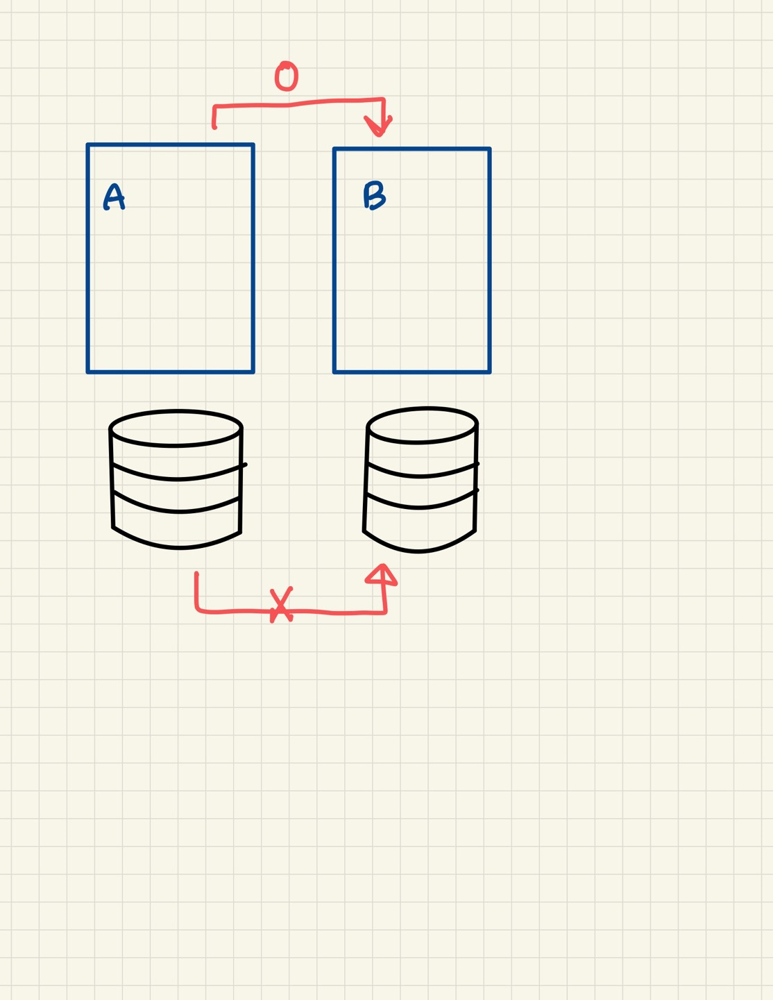

# 3장: 마이크로서비스 아키텍쳐의 기본

## 3-1. 서비스구조

### 서비스

 도메인의 해결 및 구현을 위해 활용하는 소프트웨어 컴포넌트 , 특정영역의 문제를 해결하기 위한 비즈니스 로직과 모델을 포함한다. 이들을 호출하기 위한 인터페이스(API)를 클라이언트 제공

### 비즈니스 데이터

데이터베이스 

서비스가 비즈니스 데이터를 포함한다 → 특정 DB에 접근하려면 특정 서비스를 통해야 한다. 

불특정 다수의 애플리케이션에서 DB를 공유 → 마이크로서비스적 설계가 아님.

## 3-2. 레이어 아키텍쳐

특정 기준에 근거해서 여러 계층을 만들고, 그 계층구조를 따라서 소프트웨어 컴포넌트나 기능을 분류, 관리하는 접근법이 레이어 아키텍쳐.

**사용자 인터페이스 계층** : 사용자 인터페이스 구축, 렌더링, 요청/응답 전송

**애플리케이션 계층**: 애플리케이션 조율, 도메인 객체 접근, 트랜잭션 관리 

**도메인계층**: 도메인 상태와 동작(비즈니스 로직)을 구현하는 서비스 배치

**인프라계층**: 가장 아래에 있음. 외부 리소스가 다른 계층에 접근할 수 있도록 지원. 데이터베이스나 메시징 같은 외부 시스템과 연동할 때 사용

**✅ 파사드 디자인 패턴**

: 일련의 저수준 인터페이스들을 하나의 고수준 인터페이스들로 묶어주는 패턴

저수준 인터페이스의 동작을 제어하려면 여러 저수준 인터페이스 메서드들을 일일이 호출해야하는데 파사드 패턴을 이용하면 고수준 인터페이스 호출만으로 한번에 할 수 있다.

[https://kotlinworld.com/372](https://kotlinworld.com/372)

### ⚒️ 레이어 아키텍쳐의 장단점

장점: 간단하면서 이해하기 쉽다. 기능 분할이나 구조화를 진행하기 쉬워서 소프트웨어 컴포넌트를 조합해서 개발하는 방식에 적합

단점: 확장성이 약하다.  추상적인 것이 구체적인 것에 의존하기 때문!

소프트웨어 컴포넌트가 인프라 구현에 의존하고 있다. 

(확장성: 레이어 아키텍쳐 프로그램은 그대로 유지하고 프로그램은 인프라만 변환한다는 것)

### 📶 해결책: 제어반전

제어반전이란 특정 소프트웨어 컴포넌트와 그 컴포넌트를 의존하는 측의 의존관계를 역으로 반전시키는 것.

스프링에서는 DI를 통해 제어반전을 구현. IoC를 도입한 것이 헥사거널 아키텍쳐

## 3-3. 헥사거널 아키텍쳐

불특정한 데이터 입출력에 대응할 수 있도록 확장성을 가진 것이 특징.

도메인(비즈니스 로직)을 중심으로 함. 주변에는 도메인을 호출하는 입력 측과 도메인에 의해 실행되는 출력측이 있음.

### ✅ 포트와 어댑터

어댑터: 외부 기능과 상호작용하는 역할을 하며, 외부 기능 단위로 교체 가능. 

포트:추상화된 프로그래밍 인터페이스를 도메인에 제공하는 것.

포트&어댑터 구조: 외부기능에 의존하지 않는 비즈니스 로직 설계 및 구현 , 외부 기능 쉽게 교체할 수 있어서 확장성 챙기기도 가능.

**컨트롤러**가 **인바운드 어댑터**

**서비스**에 접근할 때는 **포트**

인터페이스 계층과 인프라 계층에서 사용하는 드라이버들이 헥사거널의 포트와 어댑터에 배치됨.

애플리케이션 서비스, 도메인 서비스, 인프라 서비스 일부가 헥사거널 중심 육각형에 위치함.

## 3.4. 데이터베이스 접근

모델 == 비즈니스 데이터

마이크로서비스에서는 자신이 포함하지 않은 모델에 접근할 때는 해당 모델이 속한 서비스를 거쳐서 데이터에 접근. **여러 서비스가 하나의 데이터베이스 공유 X** 

why? 데이터베이스 변경에 대한 배려 때문!

공유 데이터베이스 모델을 취하고 있다면 여러 프로그램을 변경해야 해서 오히려 유연하고 신속한 데이터베이스 변경에 방해가 됨 

## 3.5. 트랜잭션 처리

### 로컬 트랜잭션

- 마이크로서비스에서는 로컬 트랜잭션을 추천함.
- 로컬 트랜잭션이란 하나의 트랜잭션 컨텍스트 내에 처리 대상 리소스를 제한하는 것.

💚 **예시**

1. begin과  commit으로 구분된 범위에 **하나의 데이터베이스**만을 처리대상으로 한다는 것,
2. 서비스가 하나의 DB를 포함하고 트랜잭션 컨텍스트 내에서 해당 DB만 대상으로 처리하는 경우

### 글로벌 트랜잭션

- 하나의 트랜잭션 컨텍스트 안에서 **여러 리소스 처리**하는 것
- **분산 트랜잭션 구조** 사용하여 구현
- ‘동시에’ 해야하는 경우에 사용
- 마이크로 서비스에서는 그닥 추천하지 않음 (컴포넌트의 느슨한 결합을 방해할 수 있기 때문)

## 3.6. 데이터베이스 간 동기화

기존보다 작은 단위로 여러 데이터베이스를 운영해야하는데 이런 데이터베이스들을 동기화하려면 어떻게 해야할까?

### 사가

- 데이터베이션 동기화를 위한 솔루션.
- 로컬 트랜잭션, 이벤트, 보상 트랜잭션 등의 기술 및 기법을 사용해서 여러 리소스간 동기화 취하는 디자인 패턴
- 최초 ****서비스**가 최초 **데이터베이스를 변경**하고, db 변경이 성공하면 메시징 구조를 사용해서 이벤트를 전달.
- 만약 장애가 발생해서 db 변경에 실패했다면? → 장애 발생 이전에 db에 적용한 내용을 되돌리는 로컬 트랜직션 실행 . 이것을 **보상 트랜잭션**이라고 함.
- 데이터베이스의 일관성 유지해야할때는 사가가 적합하지 않음

a가 b의 데이터 필요하면 b의 데이터에 요청하는게 아니라 b의 **서비스**에 요청해야함.

스키마가 안맞아서 에러가 뜰 수 있기 때문!

DB가 나누어져 있으니 물리적인 트랜잭션은 불가능함. Solution이 사가 트랜잭션!

실패하면 끝까지 롤백하는 이벤트+보상 트랜잭션 기법 사용

서로 메세지로 통신 (메세지 받는 순간 데이터 넣기 , 로직이 실패한다면 그 전에 또 알려줘야함 , 실패했으니 롤백 시켜라 —> 보상 트랜잭션)

## 3.7. 데이터 결합

여러 데이터베이스에 나누어져 있는 데이터를 하나의 뷰로 구성해서 클라이언트에 제공하려면?

1)  API 컴포지션

도메인계층의 집약 서비스와 인프라 계층의 리포지터리 서비스를 통해서 복수의 DB로 부터 얻은 데이터를 애플리케이션 계층에서 인메모리로 결합하는 디자인 패턴.

장점: 직감적이고, 간단하며 설계와 구현에 용이

단점: 운영환경의 메모리 내에서 결합하기 때문에 처리가 메모리에 집중됨 → 시스템 리소스에 큰 부담을 주어 성능및 확장성에 큰 영향

2) CQRS와 이벤트 소싱

- 데이터 결합의 해결책 , 결과 일관성을 구현하는 새로운 데이터 접근 패턴

### CQRS

데이터 접근처리를 갱신형 처리(명령, 데이터 삽입/변경/삭제) 와 참조형 처리(질의, 데이터 검색/취득)으로 구분하고, 각각을 구현하기 위해 독립된 서비스 컴포넌트와 데이터 저장소를 두는 디자인 패턴

갱신형 처리의 목표 : 요청량이 적기에 안전하고 확실한 트랜잭션 요구

참조형 처리의 목표 : 요청량이 많기에 빠른 응답 필요로

⇒ 갱신형 처리용과 참조형 처리용으로 분리된 프로그램과 데이터 저장소를 사용하자는 발상이 CQRS!

### 이벤트 소싱

갱신형 저장소와 참조형 저장소를 동기화 해주는 구조가 이벤트 소싱

비즈니스 데이터와 친한 데이터 처리 모델

비즈니스 데이터를 분할하지 않고 그대로 모아서 하나의 데이터 저장소에 저장. 이 데이터 저장소를 이벤트 소스라고 함. 

이벤트 소싱이 이력을 저장,보관하기엔 좋지만 빠른 검색에는 적합하지 않음

필요에 따라 검색용 데이터 스토어를 준비하고 메시징 기반 미들웨어의 비동기 메시징을 이용해 이벤트 소스와 검색용 데이터 저장소 동기화 

### CQRS와 이벤트 소싱의 장단점

장점: 쿼리 구현의 용이성, 데이터 감시, 접근 제어 구현의 용이성, 서비스 모델링과 친화성이 높음

단점: 기존 설계방식과 다른 난해함

## 3.8. 서비스 간 연계

서비스간 통신프로토콜로 자주사용되는 것이 REST와 메시징

### REST

클라이언트가 요청을 전송한 후 그에 대한 응답을 기다리는 동기형 프로토콜

### 메시징

단순한 처리는 물론이고 복잡하고 무거운 처리패턴까지 고려하면 서비스 간 연계기법인 메시징을 사용하는 것이 좋음. MOM을 통해서 생산자,소비자가 메시지를 주고 받는 통신 모델

## 3.9. 서비스화 진행방법

### 세션정보 유지

세션 영구화 : 처리 중인 상태를 데이터베이스등의 영구적 데이터 저장소에 저장해 두는 기능

스티키 세션: 처리상태가 저장돼 있는 서버(프로세스나 컨테이너)에 클라이언트 요청을 전송하는 것 

⇒ 부하분산 장치나 웹 애플리케이션 서버등이 가지고 있는 기능, 클라우드 네이티브 컴퓨팅 제품들도 제공. (쿠버네티스!)

마이크로 서비스에서 세션정보를 유지하려면 상태의 서비스화 기법을 사용하는 것도 추천!

상태를 유지하기 위한 서비스 신설하고, 스테이트 자체는 DB등의 영구저장소에 저장. 최종 사용자의 요청과 상태는 사용자 ID로 연결 

마이그레이션 기간 중의 의존관계

기존 모노리스가 신규 릴리스할 서비스에 의존 → ✔️

신규서비스가 기존 모노리스에 의존 → ❌

WHY? 가까운 미래에 기존 모노리스를 변경하는 경우 더 큰 영향을 미쳐서 마이크로서비스의 서비스화에 영향 미침 

## 질문

- 마이크로서비스에서는 하나의 서비스가 오직 하나의 데이터베이스를 가지는 것인가요? 여러개의 db를 가질 수는 없나요?